## Unit 18 Homework: Lets go Splunking!

---

## Vandalay Industries Monitoring Activity Instructions

### Step 1: The Need for Speed 

**Background**: As the worldwide leader of importing and exporting, Vandalay Industries has been the target of many adversaries attempting to disrupt their online business. Recently, Vandaly has been experiencing DDOS attacks against their web servers.

Not only were web servers taken offline by a DDOS attack, but upload and download speed were also significantly impacted after the outage. Your networking team provided results of a network speed run around the time of the latest DDOS attack.

**Task:** Create a report to determine the impact that the DDOS attack had on download and upload speed. Additionally, create an additional field to calculate the ratio of the upload speed to the download speed.

1.  Upload the following file of the system speeds around the time of the attack.
    - [Speed Test File](resources/server_speedtest.csv)

2. Using the `eval` command, create a field called `ratio` that shows the ratio between the upload and download speeds.
  > Answer: `source="server_speedtest.csv" | eval new_field_name = 'DOWNLOAD_MEGABITS' / 'UPLOAD_MEGABITS'`
  > 
  > 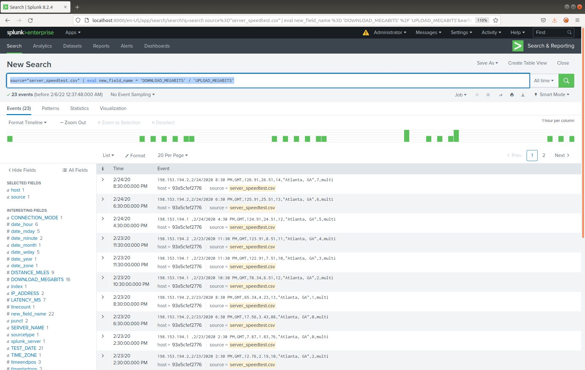
      
3. Create a report using the Splunk's `table` command to display the following fields in a statistics report:
    - `_time`
    - `IP_ADDRESS`
    - `DOWNLOAD_MEGABITS`
    - `UPLOAD_MEGABITS`
    - `ratio`
  
   > 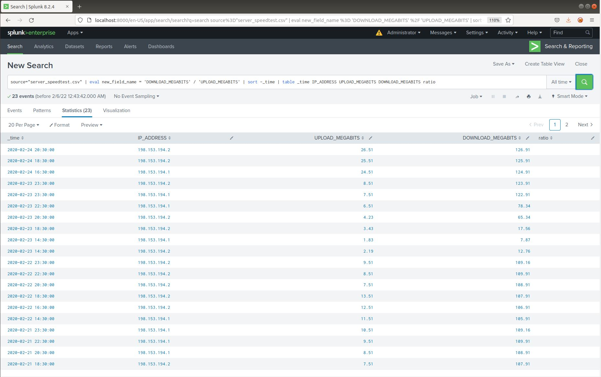
   > 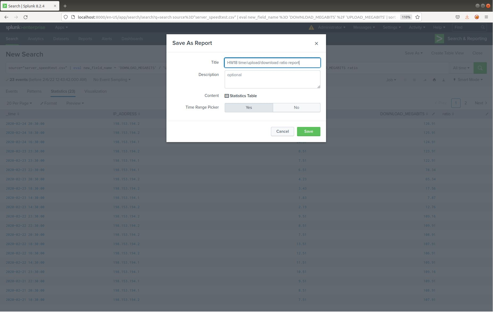
   > 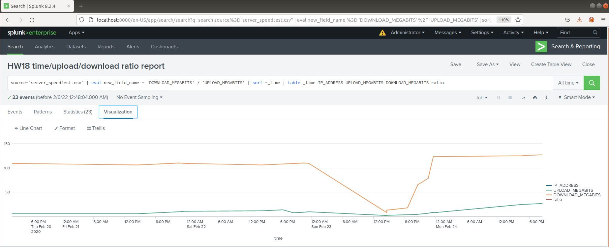

4. Answer the following questions:

    - Based on the report created, what is the approximate date and time of the attack?
      > Answer: The attack took place @2330 on Saturday, February 22nd, and reached it's lowest point @1430 on Sunday,     February 23rd.
      
    - How long did it take your systems to recover?
      > Answer: It took 12 hours from the onset of the attack @2330 Saturday, February 22nd, to the time the system returned to normal @2330 Saturday, February 23rd. 

### Step 2: Are We Vulnerable? 

**Background:**  Due to the frequency of attacks, your manager needs to be sure that sensitive customer data on their servers is not vulnerable. Since Vandalay uses Nessus vulnerability scanners, you have pulled the last 24 hours of scans to see if there are any critical vulnerabilities.

  - For more information on Nessus, read the following link: https://www.tenable.com/products/nessus

**Task:** Create a report determining how many critical vulnerabilities exist on the customer data server. Then, build an alert to notify your team if a critical vulnerability reappears on this server.

1. Upload the following file from the Nessus vulnerability scan.
   - [Nessus Scan Results](resources/nessus_logs.csv)

2. Create a report that shows the `count` of critical vulnerabilities from the customer database server.
   - The database server IP is `10.11.36.23`.
   - The field that identifies the level of vulnerabilities is `severity`.

   > Answer: `source="nessus_logs.csv" |search dest_ip="10.11.36.23" | eval CRITICAL=IF(severity="critical", "Critical", "Non-Critical") | stats count by CRITICAL`
   > 
   > 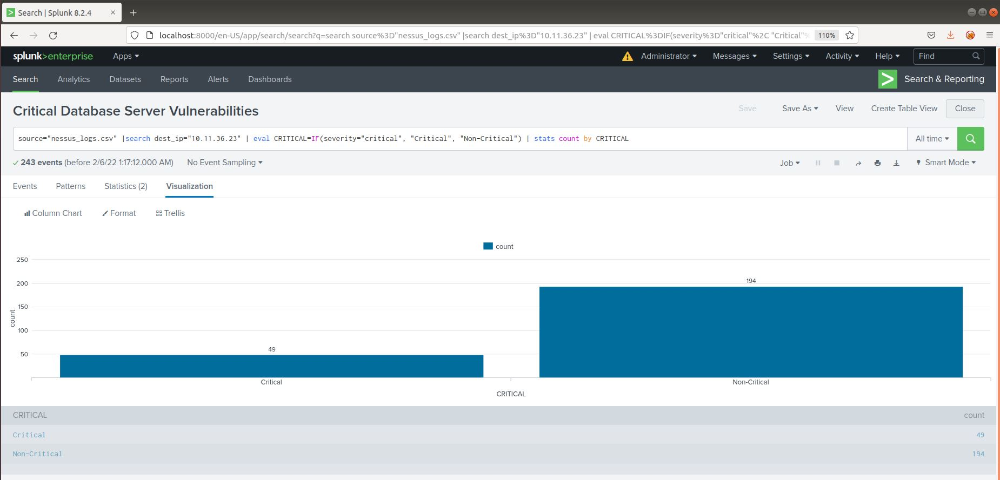
 
3. Build an alert that monitors every day to see if this server has any critical vulnerabilities. If a vulnerability exists, have an alert emailed to `soc@vandalay.com`.

   > 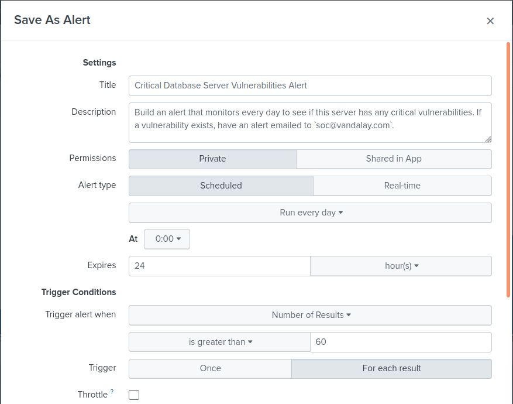
   > 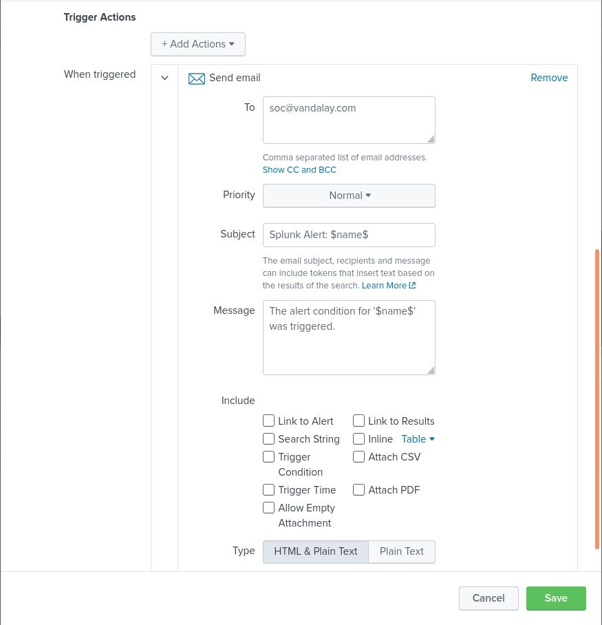
   > 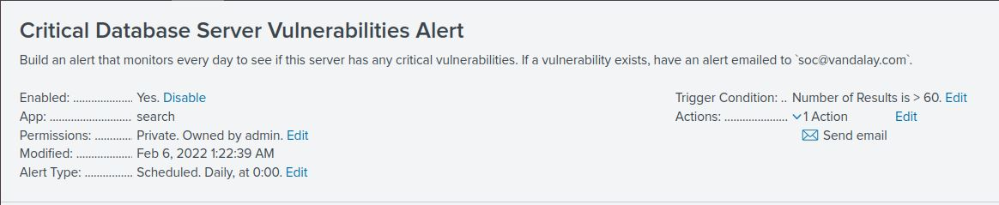

### Step 3: Drawing the (base)line

**Background:**  A Vandaly server is also experiencing brute force attacks into their administrator account. Management would like you to set up monitoring to notify the SOC team if a brute force attack occurs again.

**Task:** Analyze administrator logs that document a brute force attack. Then, create a baseline of the ordinary amount of administrator bad logins and determine a threshold to indicate if a brute force attack is occurring.

1. Upload the administrator login logs.
   - [Admin Logins](resources/Administrator_logs.csv)

2. When did the brute force attack occur?
   > Answer: The attack started @0900 Friday, February 21st and stopped @1300 Friday, February 21st. 
   > 
   > Command: `source="Administrator_logs.csv" | stats count by name`
   > 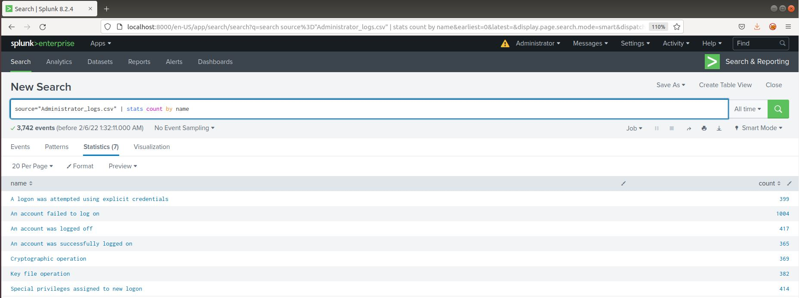
   > **Note that the number of `An account failed to log on` counts was: `1004`**
   >
   > Command: `source="Administrator_logs.csv" | stats count by name | sort -count | eval BruteForce=if(name="An account failed to log on" AND count>5, "Potential Brute Force", "Not Brute Force")`
   > 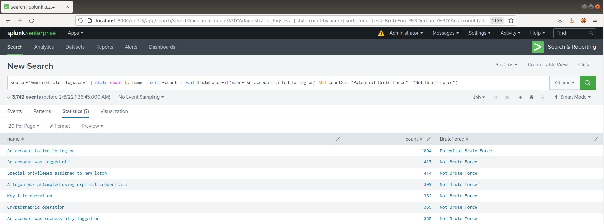
        
3. Determine a baseline of normal activity and a threshold that would alert if a brute force attack is occurring.
   > Answer: The baseline I chose is between `5-30`, and the threshold I chose was `40`. 
   
4. Design an alert to check the threshold every hour and email the SOC team at SOC@vandalay.com if triggered. 
   > Answer: I set the threshold in the alert to `count>40`
   > 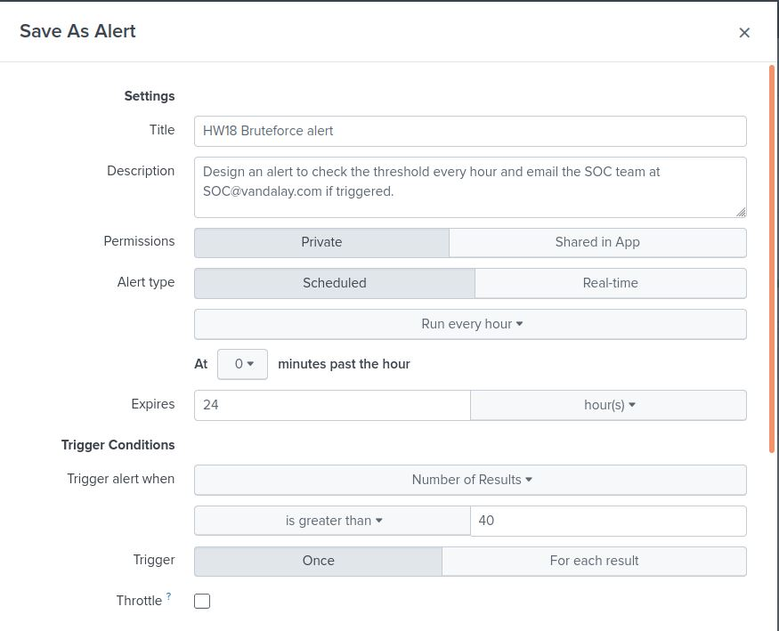
   > 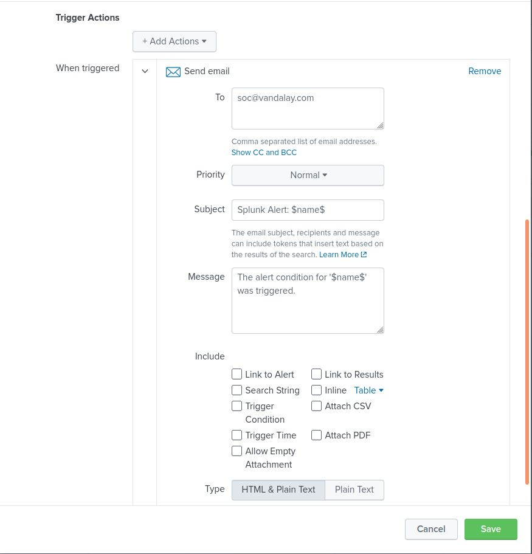
   > 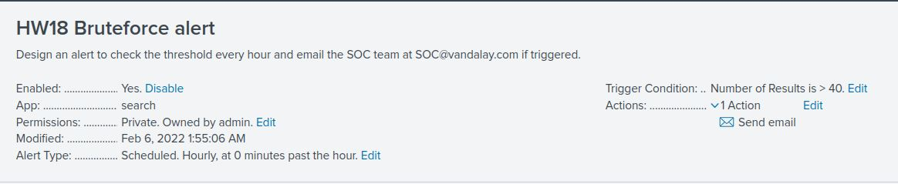
   
Submit the answers to the questions about the brute force timing, baseline and threshold. Additionally, provide a screenshot as proof that the alert has been created.

---

© 2020 Trilogy Education Services, a 2U, Inc. brand. All Rights Reserved.
